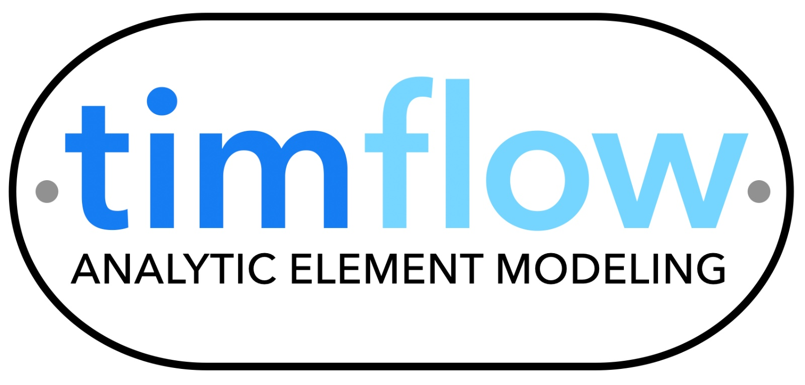

# timflow, a multi-layer analytic element model

`timflow` is a Python package for the modeling of multi-layer flow with analytic
elements. Is is split into two main submodules: `timflow.steady` for steady-state flow
and `timflow.transient` for modeling transient flow. Both modules may be applied to an
arbitrary number of aquifers and leaky layers. The head, flow, and leakage between
aquifers may be computed semi-analytically at any point in space and time. 

The design
of `timflow` is object-oriented and has been kept simple and flexible.
New analytic elements may be added to the code without making any changes in the
existing part of the code. `timflow` is coded in Python and uses `numba` to speed up
evaluation of the line elements and inverse Laplace transforms.
The `transient` submodule is based on the Laplace-transform analytic element
method. The solution is computed analytically in the Laplace domain and converted back
to the time domain numerically usig the algorithm of De Hoog, Stokes, and Knight.

## Installation

`timflow` requires Python >= 3.11 and can be installed from PyPI:

`pip install timflow`

To install all optional dependencies (for running tests and building docs):

`pip install timflow[dev]`

## Documentation

The documentation is hosted on [readthedocs](https://timflow.readthedocs.io).

## History

`timflow` combines the old packages [`TimML`](https://github.com/mbakker7/timml)
and [`TTim`](https://github.com/mbakker7/ttim). Git history is maintained within this new package, but the old repositories are still available for searching through old issues, pull requests, and other information.

## Citation

Some of the papers that you may want to cite when using `timflow` are:

* Steady-state flow:
  * Bakker, M., and O.D.L. Strack. 2003. Analytic Elements for Multiaquifer Flow.
  Journal of Hydrology, 271(1-4), 119-129. [https://doi.org/10.1016/S0022-1694(02)00319-0](https://doi.org/10.1016/S0022-1694(02)00319-0)
* Transient flow:
  * M. Bakker. 2013. Semi-analytic modeling of transient multi-layer flow with TTim.
  Hydrogeology Journal, 21: 935-943. [https://doi.org/10.1007/s10040-013-0975-2](https://doi.org/10.1007/s10040-013-0975-2)
  * M .Bakker. 2013. Analytic modeling of transient multi-layer flow. In: Advances in
  Hydrogeology, edited by P Mishra and K Kuhlman, Springer, Heidelberg, 95-114.
